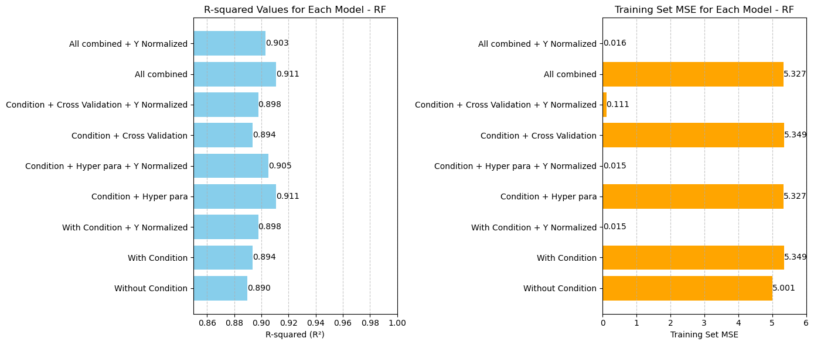

# Machine Learning Model for Medal Prediction

Developing a machine learning model for medal prediction aims to forecast how many medals
a country might win based on various factors. By using historical Olympic data, I will train the
model with features such as a country's previous performance, economic indicators,
population, and whether they are hosting.
This approach helps identify patterns and trends, allowing for more accurate medal
predictions for future Olympics. Through this process, I will evaluate model accuracy and
refine predictions to better understand the key drivers of Olympic success.

### Data Selection and Splitting:
#### Selected Data Range: 1992 to 2020
Reasoning: Chose this range to include data from after the dissolution of the Soviet Union
(which ended in 1991) to ensure consistent country identifiers and data accuracy.
#### Training Set: 1992 to 2016
Purpose: To build the model using historical data and trends up to the 2016 Olympics.
#### Test Set: 2020
Purpose: To evaluate the model’s performance and predictive accuracy on the most recent
Olympic data.

### Features Plan to Use:
#### Demographic and Economic Indicators:
Total Population
Population Growth
GNI per Capita
GDP
GDP Growth
GDP per Capita
% World Population
% World GDP
Year
#### Olympic-Specific Metrics:
Total Athletes Each Year By Country
Total Events Each Year By Country
Host Country Status (Host or Not)
#### Geographical and Developmental Factors:
Region
HDI (Human Development Index)
#### Dependent Variable (Y):
Total Medals Each Year By Country

## Exploratory Data Analysis (EDA)
### 01). Variable Importance Plot – Random Forest Regressor

### 02). Total Medals vs. GDP Percentage (2008,2012, 2016, 2020)

### 03). Correlation Matrix

### 04). Total Medals by Region

## Machine Learning Model
## Phase 01

### Feature Scaling :
* Z – Score Scaled -
'population_total‘ , 'population_growth ', 'GNI_per_capita‘ , 'GDP‘ ,‘ GDP_growth‘ , ‘GDP_per_capita',
'Population_Percentage‘ , 'GDP_Percentage‘ , 'HDI‘
* One-Hot Encoded –
'Region

### Models :
* ‘Linear Regression': LinearRegression(),
* 'Ridge': Ridge(),
* 'Lasso': Lasso(),
* 'Poisson': PoissonRegressor(),
* 'Random Forest': RandomForestRegressor(n_estimators=100, random_state=42),
* 'Support Vector Regression': SVR(kernel='linear')

### Results
| Model             | Train MSE  | Test R²    |
|-------------------|------------|------------|
| Linear Regression | 115.860113 | 0.702645   |
| Ridge             | 116.267909 | 0.700717   |
| Lasso             | 134.060115 | 0.687466   |
| Poisson           | 155.43979  | 0.145245   |
| Random Forest     | 11.466192  | 0.854375   |
| SVR               | 138.77008  | 0.669613   |

| Country                   | Actual Total Medals | Linear Regression | Ridge      | Lasso      | Poisson    | Random Forest | Support Vector Regression |
|---------------------------|---------------------|-------------------|------------|------------|------------|---------------|---------------------------|
| United States              | 113                 | 140.538222         | 138.178321 | 129.958261 | 149.295001 | 113.7         | 133.023632                 |
| China                      | 88                  | 104.656628         | 108.654256 | 102.37808  | 210.189533 | 83.58         | 100.940126                 |
| Japan                      | 58                  | 38.199706          | 37.7423    | 38.19935   | 24.991964  | 40.95         | 33.220111                  |
| United Kingdom             | 65                  | 27.405588          | 27.0314    | 23.770888  | 21.813028  | 47.31         | 21.361607                  |
| Russian Olympic Committee  | 71                  | 21.248297          | 21.521613  | 17.729284  | 17.631368  | 45.36         | 15.42964                   |

## Phase 02
### Feature Scaling :
* Z – Score Scaled -
'population_total‘ , 'population_growth ', 'GNI_per_capita‘ , 'GDP‘ ,‘ GDP_growth‘ , ‘GDP_per_capita', 'HDI‘
* One-Hot Encoded -
'Region‘
* Population_Percentage and GDP_Percentage features are not normalized and used in their original form

### Models :
* ‘Linear Regression': LinearRegression(),
* 'Ridge': Ridge(),
* 'Lasso': Lasso(),
* 'Random Forest': RandomForestRegressor(n_estimators=100, random_state=42),
* 'Support Vector Regression': SVR(kernel='linear')

### Special Conditions : 
* 01). Predicted medals must be integers.
* 02). No negative values; minimum is 0.

### Results
* Get results for the Z-Score normalized target value of total medals and the original target value
of total medals.

| Model                          | Normalization        | RMSE       | MSE        | R²         |
|---------------------------------|----------------------|------------|------------|------------|
| Linear Regression               | Without Normalized Y | 7.195084   | 51.769231  | 0.858774   |
| Linear Regression               | Normalized Y         | 7.195084   | 51.769231  | 0.858774   |
| Lasso                           | Without Normalized Y | 7.00157    | 49.021978  | 0.866268   |
| Lasso                           | Normalized Y         | 19.146916  | 366.604396 | -0.000095  |
| Ridge                           | Without Normalized Y | 7.378317   | 54.43956   | 0.851489   |
| Ridge                           | Normalized Y         | 7.088142   | 50.241758  | 0.862941   |
| SVR                             | Without Normalized Y | 16.597696  | 275.483516 | 0.248482   |
| SVR                             | Normalized Y         | 9.876713   | 97.549451  | 0.733886   |
| Random Forest                   | Without Normalized Y | 6.215012   | 38.626374  | 0.894627   |
| Random Forest                   | Normalized Y         | 6.028321   | 36.340659  | 0.900863   |

| Country | Actual | LR  | Lasso | Ridge | SVR | Random Forest | LR Normalized | Lasso Normalized | Ridge Normalized | SVR Normalized | RF Normalized |
|---------|--------|-----|-------|-------|-----|---------------|---------------|------------------|------------------|----------------|---------------|
| USA     | 113    | 128 | 118   | 127   | 12  | 114           | 128           | 12               | 127              | 65             | 114           |
| CHN     | 88     | 90  | 85    | 99    | 12  | 56            | 90            | 12               | 92               | 49             | 58            |
| JPN     | 58     | 64  | 68    | 65    | 19  | 55            | 64            | 12               | 63               | 37             | 54            |
| GBR     | 65     | 41  | 40    | 40    | 17  | 44            | 41            | 12               | 40               | 29             | 44            |
| ROC     | 71     | 33  | 33    | 35    | 23  | 48            | 33            | 12               | 34               | 37             | 49            |
| AUS     | 46     | 46  | 46    | 46    | 23  | 31            | 46            | 12               | 46               | 39             | 31            |
| NED     | 36     | 26  | 26    | 26    | 15  | 20            | 26            | 12               | 25               | 16             | 21            |
| FRA     | 33     | 43  | 41    | 43    | 20  | 39            | 43            | 12               | 42               | 30             | 39            |
| GER     | 37     | 49  | 47    | 49    | 24  | 38            | 49            | 12               | 48               | 36             | 38            |
| ITA     | 40     | 37  | 37    | 37    | 18  | 31            | 37            | 12               | 37               | 27             | 30            |

## Phase 03
### Principal Component Analysis :
* GDP and GDP_Percentage
* population_total and population_percentage
* GNI_per_capita and GDP_per_capita
* Events_Count and Total_Athletes

### Feature Scaling :
* Z – Score Scaled -
'population_growth ',‘ GDP_growth‘ ,, 'HDI‘
* One-Hot Encoded –
'Region'

### Models:
* ‘Linear Regression': LinearRegression(),
* 'Ridge': Ridge(),
* 'Lasso': Lasso(),
* Weighted LR
* 'Random Forest': RandomForestRegressor(n_estimators=100, random_state=42),

### Special Conditions :
* 01). Predicted medals must be integers.
* 02). No negative values; minimum is 0.

### Results
#### Without normalize Y
| Model         | R²          | MSE           |
|---------------|-------------|---------------|
| LR            | 0.86177156  | 55.61400262   |
| Weighted LR   | 0.845283674 | 89.33924483   |
| Lasso         | 0.871604336 | 61.16156825   |
| Ridge         | 0.861201978 | 55.65246288   |
| Random Forest | 0.89240905  | 5.349440748   |

#### With normalize Y
| Model         | R²          | MSE           |
|---------------|-------------|---------------|
| LR            | 0.86177156  | 0.160083209   |
| Weighted LR   | 0.845613432 | 0.257160289   |
| Lasso         | 0.85985297  | 0.167875721   |
| Ridge         | 0.860782287 | 0.160193916   |
| Random Forest | 0.896426098 | 0.015145438   |

## Phase 04
#### Consider only the Random Forest model.
Use Random Forest with cross-validation and hyperparameter tuning, along with the specified
special condition

#### Perform cross-validation
cv = KFold(n_splits=5, shuffle=True, random_state=42) 

#### Initialize the Random Forest model with the best parameters
model = RandomForestRegressor(
n_estimators=500,
max_depth=20,
max_features='sqrt',
min_samples_split=2,
min_samples_leaf=1,
random_state=42
)

### Special Conditions : 
* 01). Predicted medals must be integers.
* 02). No negative values; minimum is 0.
* 03). Predicted medals must equal actual total medals.

### Results
| Model Name                              | Test Set Multiple R | Test Set R-squared (R²) | Test Set Std. Error | Training Set MSE    |
|------------------------------------------|---------------------|-------------------------|---------------------|---------------------|
| Without Condition                        | 0.943308509         | 0.889830944             | 6.354889093         | 5.001277383         |
| With Condition                           | 0.945356072         | 0.893698103             | 6.242357965         | 5.349440748         |
| With Condition + Y Normalized            | 0.947478312         | 0.897715151             | 6.123275716         | 0.015145438         |
| Condition + Hyper para                   | 0.954382263         | 0.910845504             | 5.716757707         | 5.327314522         |
| Condition + Hyper para + Y Normalized    | 0.95142506          | 0.905209645             | 5.894680038         | 0.015374254         |
| Condition + Cross Validation             | 0.945356072         | 0.893698103             | 6.242357965         | 5.349440748         |
| Condition + Cross Validation + Y Normalized | 0.947478312      | 0.897715151             | 6.123275716         | 0.111340807         |
| All combined                             | 0.954382263         | 0.910845504             | 5.716757707         | 5.327314522         |
| All combined + Y Normalized              | 0.950337395         | 0.903141165             | 5.958648715         | 0.016055945         |

####  R² & MSE For Each Model

#### Final Table
| Country           | Predicted Medals | Total Medals |
|-------------------|------------------|--------------|
| United States      | 115              | 113          |
| China             | 76               | 88           |
| Japan             | 64               | 58           |
| United Kingdom    | 43               | 65           |
| Russia            | 48               | 71           |
| Australia         | 37               | 46           |
| Netherlands       | 21               | 36           |
| France            | 39               | 33           |
| Germany           | 46               | 37           |
| Italy             | 34               | 40           |

